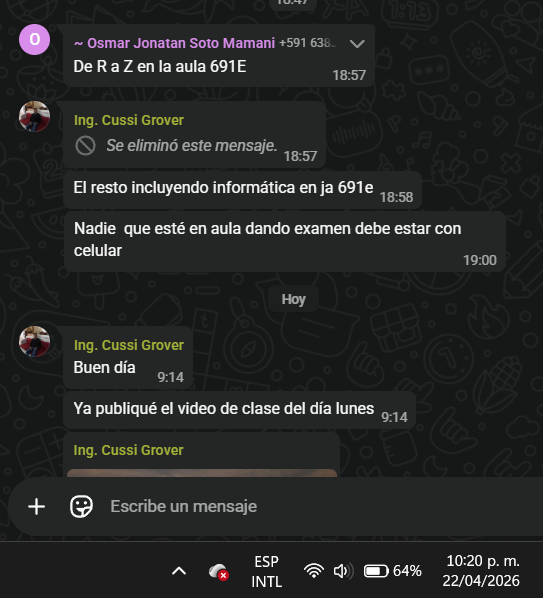

# CURSO DE GIT 
## CLASE - 01 
## ¿Qué es Git?
Es un Sistema de Control de Versiones, que nos permite llevar un control de los cambios realizados en nuestros proyectos, facilitando la colaboración entre varios desarrolladores.
Permitiendo a los desarrolladores trabajar de manera conjunta en un proyecto, sin preocuparse por los conflictos de código o la pérdida de información. Git registra cada cambio realizado en el proyecto, lo que permite revertir a versiones anteriores si es necesario y facilita la colaboración entre equipos de desarrollo.
## ¿Cómo nació Git?
Git nació en abril de 2005, creado por Linus Torvalds (creador de Linux), tras la necesidad de un sistema de control de versiones rápido y distribuido para el kernel de Linux.
Surgió tras la polémica cancelación de la licencia gratuita de BitKeeper, el sistema que usaban anteriormente, lo que obligó a Torvalds a diseñar uno nuevo en poco más de una semana.
## Cómo instalar Git?
### En Windows:
1. Descarga el instalador desde la página oficial: https://git-scm.com/downloads
2. Ejecuta el instalador y sigue las instrucciones. Puedes dejar las opciones por defecto, pero asegúrate de seleccionar "Git from the command line and also from 3rd-party software" para usar Git desde la terminal.
3. Una vez instalado, abre la terminal (Git Bash) y verifica la instalación con el comando:
   ```
   git --version
   ```      
### En macOS:
1. Abre la terminal y ejecuta el siguiente comando para instalar Git usando Homebrew:
   ```
   brew install git
   ```      
2. Verifica la instalación con el comando:
   ```
    git --version
    ```
### En Linux:
1. Abre la terminal y ejecuta el siguiente comando para instalar Git:   
    - En Debian/Ubuntu:
      ```
      sudo apt-get update
      sudo apt-get install git
      ```
    - En Fedora:
      ```
      sudo dnf install git
      ```
    - En Arch Linux:
      ```
      sudo pacman -S git
      ```
2. Verifica la instalación con el comando:
    ```
    git --version
    ```
## Configuración inicial de Git
Después de instalar Git, es importante configurar tu nombre de usuario y correo electrónico, ya que esta información se asociará con tus commits. Para configurar Git, abre la terminal y ejecuta los siguientes comandos:
```
git config --global user.name "Tu Nombre"
git config --global user.email "tu.email@ejemplo.com"
```
        
### Archivos en todo repositorio deberia tener
- README.md: Un archivo que proporciona información sobre el proyecto, cómo usarlo, cómo contribuir, etc.
- .gitignore: Un archivo que especifica qué archivos o directorios deben ser ignorados  por Git, como archivos temporales, dependencias, etc.
- LICENSE: Un archivo que especifica la licencia bajo la cual se distribuye el proyecto, indicando los términos de uso y distribución.

## CLASE - 02
### Los estados de Git
En Git, los archivos pueden estar en diferentes estados que reflejan su situación en el proceso de desarrollo. Estos estados son fundamentales para entender cómo Git maneja los cambios y cómo se preparan los archivos para ser incluidos en los commits.
#### Directorio de trabajo (Working Directory)
Es el lugar donde se encuentran los archivos del proyecto en tu sistema de archivos. Aquí es donde realizas cambios en los archivos, como editarlos, agregar nuevos archivos o eliminar archivos existentes. El directorio de trabajo refleja el estado actual de tu proyecto.
* Untracked: El archivo no está siendo rastreado por Git. No forma parte del historial de versiones y no se incluirá en los commits a menos que se agregue explícitamente.
* Unmodified: El archivo está siendo rastreado por Git y no ha sufrido cambios desde el último commit. No se necesita hacer nada con este archivo, ya que no hay cambios que registrar.
* Modified: El archivo ha sido modificado desde el último commit, pero aún no se ha agregado al área de preparación (staging area). Para incluir estos cambios en el próximo commit, es necesario agregar el archivo al área de preparación.
Si necesitas que un archivo vuelva a su estado original, puedes usar el comando `git restore -- <archivo>`, lo que descartará los cambios realizados en ese archivo y lo devolverá a la última versión confirmada en el repositorio local.
##### ¿Qué pasa si quiero que el archivo que creé no quiero que lo vea Git?
En ese caso, puedes agregar el nombre del archivo o el patrón de archivos al archivo `.gitignore`. Esto le indicará a Git que ignore esos archivos y no los rastree ni los incluya en los commits.

#### Área de preparación (Staging Area)
Es un espacio intermedio donde puedes preparar los cambios que deseas incluir en el próximo commit. Cuando agregas un archivo al área de preparación, estás indicando que quieres que esos cambios se registren en el historial de versiones. Puedes agregar archivos al área de preparación utilizando el comando `git add <archivo>`. Y con el comando `git reset <archivo>` puedes eliminar un archivo del área de preparación, lo que significa que esos cambios no se incluirán en el próximo commit.
Al aplicar el comando `git add .`, todos los archivos modificados en el directorio de trabajo se agregarán al área de preparación, lo que significa que estarán listos para ser incluidos en el próximo commit.
#### Repositorio local (Local Repository)
Es donde Git almacena el historial de versiones de tu proyecto. Cuando realizas un commit, los cambios que has preparado en el área de preparación se registran en el repositorio local. El repositorio local es una copia completa del historial de versiones, lo que permite trabajar de manera independiente sin necesidad de una conexión a internet.
Los comandos básicos para manejar estos estados son:
- `git commit -m "Mensaje del commit"`: Crea un nuevo commit con los cambios que has preparado en el área de preparación.
- `git status`: Muestra el estado actual de los archivos en el directorio de trabajo, el área de preparación y el repositorio local, indicando qué archivos están modificados, cuáles están preparados para el commit y cuáles no están siendo rastreados por Git.
- `git log`: Muestra el historial de commits en el repositorio local, permitiéndote ver los cambios realizados a lo largo del tiempo y quién los realizó.
- `git reset --hard HEAD`: Restaura el estado del repositorio local al último commit, descartando cualquier cambio no confirmado en el directorio de trabajo y el área de preparación. Ten cuidado al usar este comando, ya que perderás cualquier cambio no confirmado.
- `git reset --soft HEAD~1`: Deshace el último commit, pero mantiene los cambios en el área de preparación. Esto te permite modificar el mensaje del commit o agregar más cambios antes de volver a confirmar.

### Buenas prácticas para el uso de Git
1. Usa verbos imperativos en los mensajes de commit: Los mensajes de commit deben ser claros y concisos, describiendo la acción realizada. Por ejemplo, "Agrega función de autenticación" en lugar de "Función de autenticación agregada".
* Add: Indica que se ha agregado una nueva función o característica al proyecto.
* Fix: Indica que se ha corregido un error o bug en el código.
* Update: Indica que se ha actualizado o mejorado una función existente.
* Remove: Indica que se ha eliminado una función o código innecesario del proyecto.

2. No uses punto final en los mensajes de commit: Los mensajes de commit no deben terminar con un punto, ya que esto puede dificultar la lectura y el seguimiento del historial de versiones. 

3. Usar como maximo 50 caracteres para el mensaje de commit: Los mensajes de commit deben ser breves y al punto, idealmente no más de 50 caracteres. Esto facilita la lectura y comprensión del historial de versiones, especialmente cuando se visualiza en herramientas como `git log` o plataformas de alojamiento de código como GitHub.

4. Usar un prefixo para el mensaje de commit: Es recomendable usar un prefijo en el mensaje de commit para indicar el tipo de cambio realizado. Esto ayuda a categorizar los commits y facilita la comprensión del historial de versiones. Algunos prefijos comunes incluyen:
* feat: Indica que se ha agregado una nueva función o característica al proyecto.
* fix: Indica que se ha corregido un error o bug en el código.
* docs: Indica que se han realizado cambios en la documentación del proyecto.
* style: Indica que se han realizado cambios en el formato o estilo del código, sin afectar la funcionalidad.
* refactor: Indica que se ha refactorizado el código, mejorando su estructura sin cambiar su comportamiento.
* test: Indica que se han agregado o modificado pruebas para el proyecto.
* chore: Indica que se han realizado tareas de mantenimiento o cambios menores que no afectan la funcionalidad del proyecto.
* perf: Indica que se han realizado cambios para mejorar el rendimiento del proyecto.
* ci: Indica que se han realizado cambios relacionados con la integración continua o el proceso de construcción del proyecto.
* build: Indica que se han realizado cambios relacionados con el proceso de construcción o compilación del proyecto.
5. Añade todo el contexto necesario en el mensaje de commit: Además de ser breve, el mensaje de commit debe proporcionar suficiente contexto para que otros desarrolladores (o tú mismo en el futuro) puedan entender claramente qué cambios se realizaron y por qué. Esto puede incluir detalles sobre la razón detrás del cambio, cómo se implementó o cualquier información relevante que ayude a comprender el propósito del commit.

> Razón por la cual no asistí a la clase 21/03/2026.
>  
> - Estaba en el parcial de la materia de Taller de Sistemas Operativos, que se llevó a cabo el mismo día.
> Hora de inicio de Parcial 18:45 pero nos dió tiempo a resolver hasta las 20:30 y de ahí a casa me demoro aproximadamente una hora y media. por lo cual no pude asistir lamentablemente.

## CLASE - 03
### ¿Qué es GitHub?
GitHub es una plataforma de alojamiento de código fuente y control de versiones basada en Git. Permite a los desarrolladores colaborar en proyectos de software, compartir código, gestionar versiones y realizar un seguimiento de los cambios realizados en el código fuente. GitHub ofrece una interfaz web intuitiva para gestionar repositorios, realizar pull requests, revisar código y colaborar con otros desarrolladores en proyectos de software.
### Git vs GitHub
| Git | GitHub |
| --- | --- | 
| Es un sistema de control de versiones. | Es una plataforma de alojamiento de código basada en Git. |
| Permite gestionar el historial de versiones de un proyecto. | Permite colaborar en proyectos de software y compartir código. |
| Es una herramienta de línea de comandos. | Ofrece una interfaz web para gestionar repositorios y colaborar con otros desarrolladores. |

#### SSH vs HTTPS
| SSH | HTTPS |
| --- | --- |
| Es un protocolo de comunicación seguro que utiliza claves SSH para autenticar a los usuarios. | Es un protocolo de comunicación seguro que utiliza certificados SSL para cifrar la conexión. |
| Requiere configuración de claves SSH en el sistema. | No requiere configuración adicional, solo autenticación con usuario y contraseña. |
| Permite una autenticación más segura y sin necesidad de ingresar credenciales cada vez. | Requiere ingresar credenciales cada vez que se realiza una operación que requiere autenticación. |
Por lo que se recomienda usar SSH para una experiencia más fluida y segura al interactuar con repositorios en GitHub, especialmente si realizas operaciones frecuentes que requieren autenticación.
#### Configurar GitHub con SSH
1. Generar una clave SSH: Abre la terminal y ejecuta el siguiente comando para generar una nueva clave SSH:
   ```
   ssh-keygen -t ed25519 -C " "tu correo electrónico"
   ```
    Sigue las instrucciones para guardar la clave en el directorio predeterminado y establece una contraseña si lo deseas.
2. Agregar la clave SSH a tu cuenta de GitHub: Copia el contenido de tu clave pública SSH (generalmente ubicada en `~/.ssh/id_ed25519.pub`) y agrégala a tu cuenta de GitHub en la sección "SSH and GPG keys" de tu configuración de perfil.
3. Configurar Git para usar SSH: Asegúrate de que Git esté configurado para usar SSH en lugar de HTTPS. Puedes hacerlo ejecutando el siguiente comando:
   ```
   git config --global url."https://github.com/".insteadOf "https://github.com/"
   ```
    Esto redirigirá automáticamente las solicitudes de GitHub a usar SSH en lugar de HTTPS. 
4. Probar la conexión SSH: Para verificar que la configuración SSH esté funcionando correctamente, ejecuta el siguiente comando:
   ```  
    ssh -T git@github.com
    ```
    Si la conexión es exitosa, deberías ver un mensaje de bienvenida de GitHub indicando que has autenticado correctamente con tu clave SSH. Ahora puedes usar Git para interactuar con tus repositorios en GitHub sin necesidad de ingresar tus credenciales cada vez.
### Crear un repositorio en GitHub
1. Inicia sesión en tu cuenta de GitHub y haz clic en el botón "New repository" para crear un nuevo repositorio.
2. Completa los detalles del repositorio, como el nombre, la descripción y la visibilidad (público o privado). Puedes elegir si deseas inicializar el repositorio con un archivo README, un archivo .gitignore o una licencia.
3. Haz clic en el botón "Create repository" para crear el repositorio.
### Conectar un repositorio local de Git con uno existente en GitHub
```
git remote add origin <URL del repositorio en GitHub>
git branch -M main
git push -u origin main 
```
Nota: Asegúrate de reemplazar `<URL del repositorio en GitHub>` con la URL real de tu repositorio en GitHub. Este comando establece una conexión entre tu repositorio local y el repositorio remoto en GitHub, permitiéndote enviar tus cambios al repositorio remoto utilizando `git push`. Para esto también es necesario haber inicializado un repositorio local de Git con `git init` y haber realizado al menos un commit antes de ejecutar estos comandos.
### Clonar un repositorio de Git
Para clonar un repositorio de Git desde GitHub, puedes usar el siguiente comando en tu terminal:  

```
git clone <URL del repositorio en GitHub>
```
Si por accidente clonaste el repositorio usando HTTPS y deseas cambiarlo a SSH, puedes usar el siguiente comando para actualizar la URL del repositorio remoto:

```git remote set-url origin <URL del repositorio en SSH>
``` 
Este comando también es útil si deseas cambiar la URL del repositorio remoto por cualquier motivo, como cambiar de un repositorio privado a uno público o viceversa. Asegúrate de reemplazar `<URL del repositorio en SSH>` con la URL real del repositorio en formato SSH.

Para verificar que la URL del repositorio remoto se ha actualizado correctamente, puedes usar el siguiente comando:

```git remote -v
```
### Cambios 
* Subir mis cambios a GitHub: Para subir tus cambios locales a GitHub, puedes usar el siguiente comando:
```git push origin <nombre de la rama>
```
* Bajar cambios de GitHub a tu repositorio local: Para bajar los cambios realizados en el repositorio remoto de GitHub a tu repositorio local, puedes usar el siguiente comando:
```git pull origin <nombre de la rama>
```